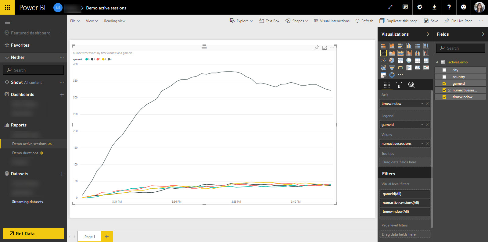
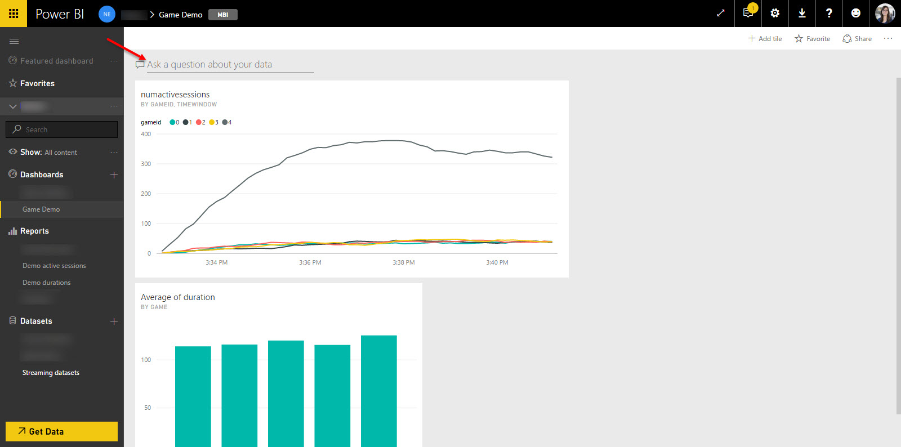
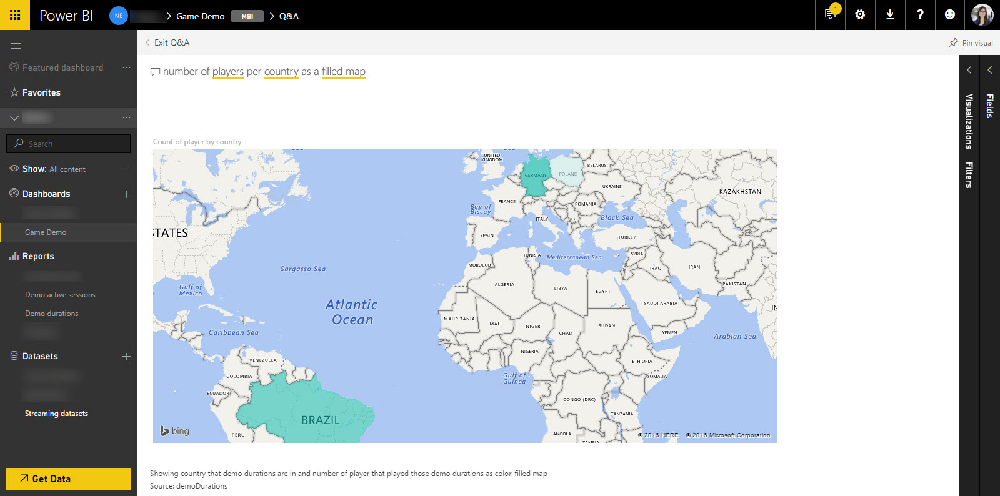

# Gaming

Demos in gaming on Azure
This is work under progress.

# Setup of game analytics demo

1. Run template deployment (armdeploy.json and armdeploy.parameters.json)
2. Setup an additional output to each Azure Stream Analytics job, named outPBI
      * sessionDurations
         * Output alias: outPBI
         * Sink: Power BI
         * Dataset Name: durations
         * Table name: durations
      * ccu
         * Output alias: outPBI
         * Sink: Power BI
         * Dataset Name: activeSessions
         * Table name: activeSessions
3. Start both Azure Stream Analytics jobs
4. GameEventsGenerator: configure the event hub connection string in app.config to the deployed event hub. Run the GameEventsGenerator.
5. Go to http://powerbi.com
   1. Click on **Streaming Datasets** and find the two datasets (durations and activeSessions) newly created by the ASA jobs. Create a report from each of them.
   
   2. Create a report based on the dataset *activeSessions*. A sample visualisation: 
   Pin this visual to a new dashboard, e.g. Game Analytics. 
   3. Create a report based on the dataset *durations*. Likewise, pin the visuals to the previously created dashboard. A sample visualisation with the dataset *durations*:  Sample queries:
      * average session duration per game id
      * average distinct number of players per game id
   4. Showcase the Q&A capabilities of Power BI:
      
Some sample queries:
      * numactivesessions per city
      * numactivesessions per city ordered by numactivesessions
      * numactivesessions per city as a map
      * numactivesessions in Germany
      * number of players per country
      * number of players per country as a map
      * number of players per country as a filled map
      * players that played Game by duration as a stack bar
      * players who played Game by duration as a stack column descending
      * players that played Game in Munich by duration as a stack bar
      Pin one of these visuals to the dashboard as well.
      