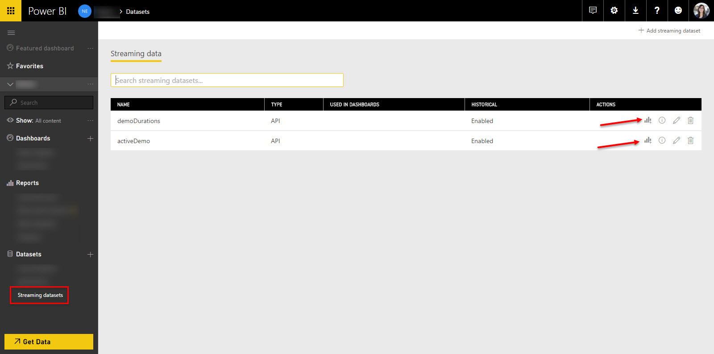
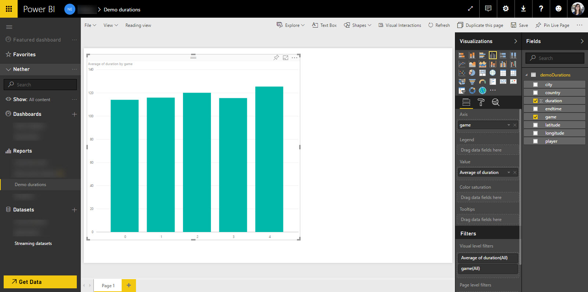

# Gaming

Demos for working with gaming data in Azure.
This is work under progress.

# Setup of game analytics demo

1. Run template deployment (armdeploy.json and armdeploy.parameters.json)
      * Watch out for resource naming restrictions, length and capitalization.
      * The arm template will add a unique identifier to the names you choose for storage accounts etc.
2. Setup an additional output to each Azure Stream Analytics job, named outPBI
      * sessionDurations
         * Output alias: outPBI
         * Sink: Power BI
         * Dataset Name: durations
         * Table name: durations
      * ccu
         * Output alias: outPBI
         * Sink: Power BI
         * Dataset Name: activeSessions
         * Table name: activeSessions
3. Start both Azure Stream Analytics jobs
4. Game Events Generators:  
      There are currently 2 different game events generators available, 1 for Windows using .Net Framework, and one for Linux / .Net Core.
      A 3rd Node.js generator is currently in development.  
      Both of the current game events generators can be deployed to a Docker container and run from there, to easily start multiple instances using **"Docker run"**.

      **GameEventsGenerator (.Net Framework 4.5)**   
      * configure the event hub connection string in app.config to the deployed event hub. 
      * Check that the Eventhub name matches the one that you specified when creating the event hub.
      * Run the GameEventsGenerator.  

      **NetCoreGameEventsGenerator (.Net Core)** 
      * configure the event hub connection string in Environment.cs to the deployed event hub. 
      * Check that the Eventhub name matches the one that you specified when creating the event hub.
      * Run the GameEventsGenerator.
      
5. Go to http://powerbi.com
   1. Click on **Streaming Datasets** and find the two datasets (durations and activeSessions) newly created by the ASA jobs. Create a report from each of them.
   
   2. Create a report based on the dataset *activeSessions*. A sample visualisation: 
   Pin this visual to a new dashboard, e.g. Game Analytics. 
   3. Create a report based on the dataset *durations*. Likewise, pin the visuals to the previously created dashboard. A sample visualisation with the dataset *durations*:  Sample queries:
      * average session duration per game id
      * average distinct number of players per game id
   4. Showcase the Q&A capabilities of Power BI:
      
Some sample queries:
      * numactivesessions per city
      * numactivesessions per city ordered by numactivesessions
      * numactivesessions per city as a map
      * numactivesessions in Germany
      * number of players per country
      * number of players per country as a map
      * number of players per country as a filled map
      * players that played Game by duration as a stack bar
      * players who played Game by duration as a stack column descending
      * players that played Game in Munich by duration as a stack bar
      Pin one of these visuals to the dashboard as well.
      

<a href="https://portal.azure.com/#create/Microsoft.Template/uri/https%3A%2F%2Fraw.githubusercontent.com%2Fedwin-huber%2Fgaming%2Fmaster%2Farmdeploy.json" target="_blank">    </a>
